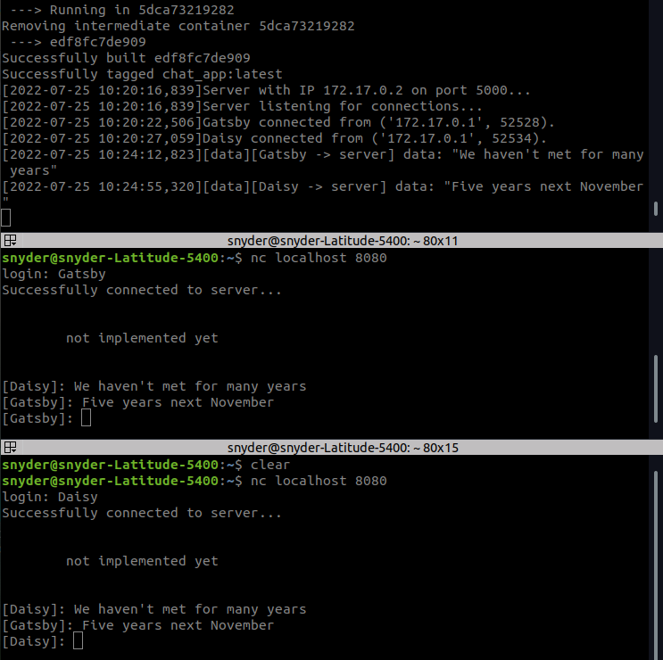

# Messaging application

Multithreaded messaging application without any security whatsoever



# Usage

For an interactive server logging session run:
```bash
chmod +x run.sh
sudo ./run.sh
```
Then client to connect with:
```bash
nc localhost 8080
```
CTRl-C to kill the server

# To-Do
    1) Login system (username, password hash, better ID method)
    2) Make a database with sqlite3
    3) Encrypt traffic
    4) Improve chat printing (functionality, colors, saved messages)
    5) Make chatrooms
    6) Better docker image management
